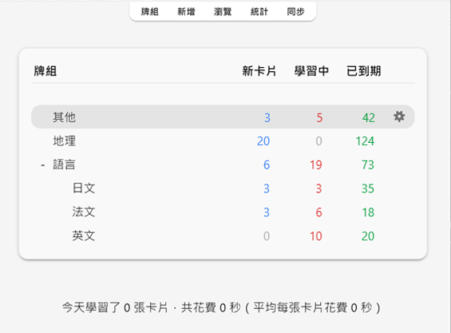

# 學習 Studying

<!-- toc -->

現在你已經找到需要的牌組，或自己加入了一些筆記，是時候開始學習了。

## 牌組 Decks

在 Anki 中，你只能學習一個當前選取的牌組，以及牌組所包含的子牌組。

牌組及下層牌組在牌組畫面中顯示為一個清單。當天的[「新卡片」、「學習中」和「已到期」（待複習）](getting-started.md#卡片種類-types-of-cards)的卡片也會在此顯示。

按下牌組後，它會被選取為「當前牌組」，並前往學習畫面。你隨時可以按一下主視窗上部的「牌組」(Decks) 回到牌組清單，選取其他牌組為當前牌組。（你也可以使用選單中的「學習牌組…」(Study Deck…) 動作，這樣只用鍵盤就能切換；你還可以按下<kbd>s</kbd>鍵來開始學習當前選取的牌組）

按一下牌組右邊的設定按鈕，可以對它重新命名或刪除、更改[選項](deck-options.md)，或將其[匯出](exporting.md)。

## 學習概覽 Study Overview

按下要學習的牌組後，你會在「牌組概覽」(deck overview) 畫面上看到今天到期的卡片數量：

卡片分為[三個種類](getting-started.md#卡片種類-types-of-cards)：新卡片、學習中和待複習。在牌組選項中啟用「[暫停關聯的 ... 卡片](#關聯卡片和暫停-siblings-and-burying)」後，會出現灰色的數字來表示將被暫停的卡片數量：

按一下「**開始學習**」(Study Now) 按鈕來進行學習。隨後 Anki 將會展示卡片，直到學完當天的所有卡片。

在學習過程中，在鍵盤上按<kbd>s</kbd>鍵就可以回到概覽畫面。

## 問題 Questions

卡片一開始只會顯示問題面。經過思考得出答案後，你可以按一下「**顯示答案**」(Show Answer) 按鈕或空白鍵，答案就會顯示出來。雖然多花一點時間答題也沒有關係，但一般如果在 10 秒內答不出來，最好是直接放棄並檢查答案，不要埋頭苦想。

顯示答案後，你應該對比自己想出來的和顯示的答案，然後選擇你的記憶水平。如果你沒把握自己校對答案，也可以請 Anki 在顯示答案之前[讓你輸入答案](templates/fields.md#檢查答案-checking-your-answer)。

## 學習/重新學習 Learning/Relearning Cards

學習中的新卡片，或忘記後重新學習中的卡片，會顯示一或多次來讓你記住。卡片每一次出現就稱作一個「學習階段」(learning step)。預設有兩個學習階段：1 分鐘和 10 分鐘。你可以在[牌組選項](deck-options.md#新卡片-new-cards)中調整學習階段的數量和時間延遲。

學習時有四個評價按鈕可選擇：

- **重來 (Again)** 會將卡片重置到第一個學習階段。

- **困難 (Hard)** 會重複當前階段。
  - 若卡片處於第一個（且僅有一個）學習階段，延遲將比該階段大 50%。但最多只會比當前學習階段長一天。
  - 若卡片處於第一個學習階段，且你設定了多個學習階段，則延遲時間取「重來」和「良好」的平均值，即第一個和第二個階段的平均值。
  - 若卡片不處於第一個學習階段，按下「困難」會重複上次的延遲時間。

- **良好 (Good)** 會讓卡片前進至[下一個學習階段](deck-options.md#學習階段-learning-steps)。如果卡片已在最後一個階段，則會成為複習卡（又稱「畢業」）。根據預設，卡片完成最後一個學習階段後，會在第二天出現，之後的延遲會逐漸延長（見下一章節）。

- **簡單 (Easy)** 會將卡片立即轉換成複習卡，無視剩餘的學習階段。[根據預設](deck-options.md#簡單間隔-easy-interval)，卡片會在 4 天後出現，之後的延遲會逐漸延長。在 v1 排程器中，重新學習時「簡單」跟「良好」的間隔一樣，因此不會顯示「簡單」按鈕。在 [v2 以上版本排程器](https://faqs.ankiweb.net/the-anki-2.1-scheduler.html)中，重新學習卡片時，「簡單」按鈕會將間隔延長 1 天。

沒有學習過的新卡片即處於第一個學習階段。此時第一次回答「**良好**」後，卡片會在 10 分鐘後再次出現，跳過 1 分鐘的初始階段。但如果你按下了「**重來**」，卡片則會在 1 分鐘後再次出現。

你可以在鍵盤上使用 <kbd>1</kbd>、<kbd>2</kbd>、<kbd>3</kbd> 和 <kbd>4</kbd> 鍵來選取各個按鈕，<kbd>1</kbd> 鍵為「**重來**」。按下<kbd>空白</kbd>鍵或 <kbd>Enter</kbd> 鍵會選取「**良好**」。

如果沒有其他卡片可以顯示，Anki 會提前顯示卡片。若要保持完整的延遲時長，你可以在[「偏好設定」>「排程」>「提前學習上限」](preferences.md)中進行調整。

## 複習 Review Cards

複習學過的卡片時，你可以選擇一個評價按鈕：

- **重來 (Again)** 表示回答錯誤，卡片未來將更常出現。即卡片被忘記 (lapse) 了。請參閱〈[忘記](deck-options.md#忘記-lapses)〉章節來進一步了解 Anki 如何處理忘記的複習卡。

- **困難 (Hard)** 預設會比上一次的間隔[稍微更長一些](deck-options.md#困難間隔-hard-interval)，增加卡片未來出現的頻率。

- **良好 (Good)** 表示上一次 Anki 安排的延遲時機恰好，無須調整卡片輕鬆度。使用[預設起始輕鬆度](deck-options.md#起始輕鬆度-starting-ease)時，卡片下一次出現的時間大約是上一次的 2.5 倍，也就是說，如果卡片上次等了 10 天輪到複習，下一次則將在 25 天後出現。

- **簡單 (Easy)** 表示 Anki 安排的延遲太短了。按下後，卡片下次出現前的延遲將比[按下「良好」更久](deck-options.md#easy-bonus)，並降低卡片未來出現的頻率。由於「簡單」會急速增加延遲，因此最好只用於最簡單的卡片。通常回答「良好」即可。

跟學習卡片時一樣，你可以在鍵盤上使用 <kbd>1</kbd>、<kbd>2</kbd>、<kbd>3</kbd> 和 <kbd>4</kbd> 鍵來回答，<kbd>1</kbd> 鍵為「**重來**」。按下<kbd>空白</kbd>鍵或 <kbd>Enter</kbd> 鍵會選取「**良好**」。

要進一步了解演算法如何工作，請參閱〈[牌組選項](deck-options.md)〉章節和 [FAQ](https://faqs.ankiweb.net/what-spaced-repetition-algorithm.html)。

## 到期數量 Due Counts

當只顯示問題時，Anki 畫面底部會顯示三個數字，如 6 + 9 + 59。這三個數字代表新卡片（藍色），學習中的卡片（紅色），以及待複習的卡片（綠色）。如果不想看到這些數字，可以在[偏好設定](preferences.md)中停用。

在 v1 排程器中，數字表示的是完成佇列中所有卡片所需的**複習**次數，而不是**卡片**數量。如果你為忘記的卡片設定了多個學習階段，則在回答失敗時，增加數字會大於 1，因為該卡片需要顯示多次。

[v2 排程器](https://faqs.ankiweb.net/the-anki-2.1-scheduler.html)以後，數字表示的是**卡片**數量，因此數字永遠只會增加 1，即使還剩餘多個學習階段。

顯示答案時，Anki 會在每個按鈕上方顯示下一次顯示卡片的預估時間。如果不想看到預估時間，可以在[偏好設定](preferences.md)中停用。

## 錯差乘數 Fuzz Factor

按下難易度按鈕的同時，Anki 會為複習卡套用少許隨機的「錯差」，這樣你在相同時間按下相同按鈕的卡片未來就不會一直都在同一天出現。這些錯差只有在啟用 [v3 排程器](https://faqs.ankiweb.net/the-2021-scheduler.html)時，才會體現在回答按鈕上，所以如果你使用的是較舊的版本，按鈕上的時間可能會跟卡片的實際間隔不一致。

學習中的卡片也會被賦予最多 5 分鐘的額外延遲，以避免每次出現的順序都相同，但這一延遲不會體現在回答按鈕上。此功能無法被停用。

## 「編輯」和「其他」 Editing and More

你可以按一下左下方的「**編輯**」按鈕來編輯當前筆記。編輯結束後則會繼續學習。編輯畫面與[新增筆記](editing.md)畫面非常相似。

右下方的「**其他**」按鈕提供了更多可為當前卡片或筆記執行的動作。

- [**為卡片加上旗標 Flag Card**](editing.md#using-flags)：為卡片加上一個有顏色的標記，或將其移除。旗標會在學習時顯示，在瀏覽器中也可以搜尋加上了旗標的卡片。如果你想要回家後再查詢單字，或是對卡片進行其他動作，旗標就是你的小幫手。在 Anki 2.1.45 及以上版本，你還可以在[瀏覽器](browsing.md)中重新命名旗標。

- **暫停卡片/筆記 Bury Card / Note**：停止複習一張卡片或一則筆記中的所有卡片，第二天再複習。（若要提前取消暫停，可以在[學習概覽](studying.md#學習概覽-study-overview)畫面按一下「取消暫停」按鈕）。若你當下無法回答某些卡片，或想改時間再學習，則可以使用此動作。暫停也可以[自動套用](studying.md#關聯卡片和暫停-siblings-and-burying)到同一則筆記的卡片。

  使用舊版排程器時，若卡片在學習時就被暫停，卡片會回到暫停前原來的新卡片或複習佇列。

  使用 [2.1 排程器](https://faqs.ankiweb.net/the-anki-2.1-scheduler.html)時，暫停卡片不會重置其學習階段。

- **忘記卡片 Forget card**：移動當前卡片到[新卡片佇列末尾](browsing.md#cards)。

  在 Anki 2.1.50 及以上版本中，當使用 v3 排程器首次學習新卡片時，Anki 會記住卡片的原始順序。在忘記卡片時可使用「回復原始順序」(Restore original position) 選項來回復卡片到原始順序。

  如果啟用「重設重複和忘記次數」(Reset repetition and lapse count) 選項，卡片的複習和失敗次數將被重設為零。卡片資訊底部的複習歷史記錄不會被移除。

- **設定到期日 Set Due Date**：將卡片加入複習佇列，並[使其在指定日期到期](browsing.md#cards)。

- **擱置卡片/筆記 Suspend Card / Note**：停止複習一張卡片或一則筆記中的所有卡片，直到手動取消擱置（透過瀏覽器中的擱置按鈕）。若你在短期內都不想要複習一則筆記，但又不想刪除，則可以使用此動作。使用舊版排程器時，若卡片在學習時就被擱置，卡片會回到擱置前原來的新卡片或複習佇列。

  使用 [2.1 排程器](https://faqs.ankiweb.net/the-anki-2.1-scheduler.html)時，擱置卡片不會重置其學習階段。

- **選項 Options**：編輯當前牌組的[選項](deck-options.md)。

- **卡片資訊 Card Info**：顯示卡片的[統計資料資訊](stats.md#card-info)。

- **上一張卡片資訊**：顯示上一張卡片的[統計資料資訊](stats.md#card-info)。

- [**標記筆記 Mark Note**](editing.md#the-marked-tag)：為當前筆記加入「marked」標籤，以便在瀏覽器中尋找。類似為卡片加上旗標，但加上的是標籤，這樣若筆記有多張卡片，則所有卡片都會在搜尋「marked」標籤時出現。通常使用旗標即可。

- **建立複本 Create Copy**：開啟編輯器，[重複](browsing.md#finding-duplicates)當前筆記的內容，你可以稍作修改來建立圍繞同一主題的不同卡片。根據預設，複本會與原筆記放入同一牌組。

- **刪除筆記 Delete Note**：刪除筆記及其所有卡片。

- **重播音訊 Replay Audio**：若卡片正面或背面有音訊，重新播放。

- **暫停音訊 Pause Audio**：若音訊正在播放，暫停播放。

- **音訊倒轉 5 秒/快轉 5 秒 Audio -5s / +5s**：倒轉/快轉正在播放的音訊 5 秒。

- **錄音 Record Own Voice**：使用你的麥克風錄音來檢查你的發音。一旦前進到下一張卡片，錄音就會被刪除。若要將音訊永久加入卡片，請編輯筆記。

- **重播錄音 Replay Own Voice**：重新播放你的上一個錄音（如顯示答案後）。

## 顯示順序 Display Order

學習時，顯示的卡片會從你選取的牌組及其下層牌組中抽取。因此，若選取學習「日文」牌組，則其下層牌組「日文::課本::第一課」和「日文::單字」也會一併顯示。

Anki 從牌組中擷取卡片的方式取決於使用的演算法：

- 使用 v1 排程器時，若牌組有下層牌組，卡片則[依各牌組順序](studying.md#顯示順序-display-order)出現。

- 使用 [v2 排程器](https://faqs.ankiweb.net/the-anki-2.1-scheduler.html)時，若牌組有下層牌組，則會從所有下層牌組中抽取卡片。下層牌組的複習上限將被無視——僅套用你選取學習的牌組的上限。

- 使用 [v3 排程器](https://faqs.ankiweb.net/the-2021-scheduler.html)時，下層牌組的上限也會被納入計算，也不需要依牌組順序來顯示卡片。請參閱〈[牌組選項](deck-options.md#牌組選項-review-sort-order)〉章節來進一步了解。

根據預設，Anki 在擷取新卡片時將依牌組名稱的字母/筆劃數順序擷取。在上述例子中，你會先看到上層牌組「日文」的卡片，然後下層牌組則以筆劃數順序先顯示「單字」再顯示「課本」。若你的牌組是「French」、「French::Vocab」和「French::My Textbook::Lesson 1」，顯示順序則為「French」→「My Textbook」→「Vocab」。你可以利用這個特性來控制卡片出現的順序，把優先級高的卡片放入在清單中靠上的牌組。 依字母順序排序時，「-」會出現在字母前，「\~」會出現在字母後。因此，若要讓牌組排在最前面，你可以把它命名為「-Vocab」；要讓另一個牌組排在最後則可以把它命名為「\~My Textbook」。

Anki 會分開擷取新卡片和複習卡，當其中一個佇列空白時不會等到另一個佇列也空白再前進到下一個牌組，所以你可能會在學習牌組 A 的複習卡的同時學到牌組 B 的新卡片，反之亦同。如果不想發生這樣的情況，你可以直接選取要單獨學習的牌組，而不是它的上層牌組。

由於學習中的卡片需要按時完成，Anki 會同時從所有牌組中擷取這些卡片，並依到期順序顯示。

要控制特定牌組的複習卡顯示順序，或將新卡片改為隨機順序出現，請參閱《[牌組選項](deck-options.md)》。要對新卡片的順序微調，請在[瀏覽器](browsing.md)中進行調整。

## 關聯卡片和暫停 Siblings and Burying

[還記得 Anki 可以為你輸入的同一項內容建立多張卡片嗎](getting-started.md)？譬如同時建立一張「正面→背面」和一張「背面→正面」卡片，或是同一段文字中建立兩個克漏字空格。像這樣幾張相關的卡片叫做「關聯卡片」(siblings)。

當你回答的卡片存在關聯的卡片時，Anki 可以自動「暫停」這些卡片來防止關聯卡片在同一次學習中一起出現。被暫停的卡片在當天不會再出現，直到第二天才會被取消隱藏，除非你使用了[牌組概覽](studying.md#學習概覽-study-overview)畫面下方的「取消暫停」(Unbury) 按鈕來手動取消暫停。即使關聯卡片與你學習的卡片不在同一個牌組內（例如當你使用了「[覆蓋牌組](templates/intro.md)」功能時）也會被暫停。

你可以在[牌組選項](deck-options.md)畫面中啟用暫停，可對新卡片和複習卡分別進行設定。

Anki 僅暫停關聯的新卡片或複習卡。學習中的卡片不會被暫停，因為按時完成這些卡片很重要。反過來，當你學了一張學習中的卡片時，與它關聯的新卡片/複習卡則會被暫停。

注意：在 [v2 排程器](https://faqs.ankiweb.net/the-anki-2.1-scheduler.html)及以上版本中，Anki 會區分手動和自動暫停的卡片，因此你可以取消暫停一張卡片的同時不影響另外一張。

另外，卡片無法同時被暫停和擱置。當你擱置卡片時，若卡片已被暫停，則會將它取消暫停。Anki 2.1.49 及以上版本中無法暫停已擱置的卡片，在較早版本中則會將卡片取消擱置。

## 快速鍵 Keyboard Shortcuts

Anki 中大多數的常用動作都可以使用快速鍵來操作。其中大多可在介面中找到：選單項目旁邊標有快速鍵，將滑鼠遊標懸停在按鈕上通常會顯示含有快速鍵的工具提示。

在學習時，按下<kbd>空白</kbd>鍵或<kbd>Enter</kbd> 鍵會顯示答案。顯示答案時，按下<kbd>空白</kbd>鍵或<kbd>Enter</kbd> 鍵會選取「良好」按鈕。使用數字鍵 <kbd>1</kbd> 至 <kbd>4</kbd> 可以選取不同難度的按鈕。許多使用者都覺得比較方便的用法是一隻手指放在<kbd>空白</kbd>鍵上來回答大多數卡片，另一隻手指放在 <kbd>1</kbd> 鍵上，忘記卡片時就能按下「重來」。

藥使用鍵盤來快速切換牌組，你可以使用「工具」選單中的「學習牌組」項目。你可以使用「/」鍵來切換。打開「學習牌組」後，視窗中會顯示你的所有牌組，上方還有一個篩選器。輸入文字，Anki 就會隨之篩選你的牌組。你可以加入空白來輸入多個搜尋詞彙，Anki 會顯示符合所有詞彙的牌組。搜尋「日 單」或「字 日」都會符合名為「日文::單字」的牌組。

## 進度落後 Falling Behind

當你的複習進度落後時，Anki 會優先顯示等待時間最長的卡片。等待時間最長的卡片會以隨機順序顯示，直至達到複習上限。這樣的順序可以確保沒有卡片會被長時間遺漏，但同時會導致你新學習的卡片不會被複習到，直到你趕上進度。

要更改逾期複習的順序，你可以建立一個[篩選牌組](filtered-decks.md)。

當你回答逾期的卡片時，逾期的時長會影響 Anki 決定卡片下次何時出現。請參閱 Anki 的間隔重複[演算法](https://faqs.ankiweb.net/due-times-after-a-break.html) 來進一步了解。
